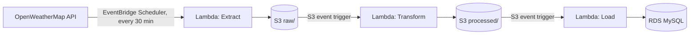

# Weather ETL Pipeline (AWS Serverless)

A serverless, event-driven ETL pipeline that ingests live weather data for five Indian cities, cleans and enriches it, and loads it into a relational database — built entirely on AWS free-tier services.



## What it does

Every 30 minutes, the pipeline automatically:
1. Fetches current weather for Bangalore, Pune, Mumbai, Nagpur, and Delhi from the OpenWeatherMap API
2. Lands the raw API response in an S3 "raw zone," untouched
3. Flattens and enriches the data (adds a derived `comfort_category` field based on temperature and humidity)
4. Writes the cleaned result to an S3 "processed zone"
5. Upserts the cleaned records into a MySQL table on RDS, ready for querying

No servers are provisioned or managed — every compute step runs as a Lambda function triggered either by a schedule or by an S3 event.

## Tech stack

- **AWS Lambda** (Python 3.12) — Extract, Transform, and Load functions
- **Amazon S3** — raw and processed data zones
- **Amazon EventBridge Scheduler** — triggers the Extract Lambda every 30 minutes
- **Amazon RDS (MySQL)** — final structured data store
- **AWS Secrets Manager** — stores the OpenWeatherMap API key and RDS credentials (never hardcoded)
- **VPC Interface & Gateway Endpoints** — private connectivity from the VPC-attached Load Lambda to Secrets Manager and S3
- **IAM** — least-privilege execution roles, one per Lambda function

## What this project demonstrates

- Event-driven serverless architecture (S3 upload events triggering downstream Lambdas), not a single monolithic script
- A proper raw/processed data lake zoning pattern, so transforms can be replayed from raw data without re-hitting the source API
- Idempotent loads: a `UNIQUE KEY(city, reading_time_utc)` constraint plus `INSERT ... ON DUPLICATE KEY UPDATE` means reprocessing the same file never creates duplicate rows
- Least-privilege IAM: each Lambda has its own role, scoped only to the specific S3 prefixes and secrets it actually needs
- Secrets management done properly — API keys and DB credentials live in Secrets Manager, not in code or environment variables
- Private networking: the Load Lambda runs inside a VPC and reaches AWS services (Secrets Manager, S3) through VPC endpoints rather than the public internet

## Architecture

| Stage | Trigger | Lambda | Reads from | Writes to |
|---|---|---|---|---|
| Extract | EventBridge Scheduler (every 30 min) | `weather-etl-extract` | OpenWeatherMap API | `s3://bucket/raw/` |
| Transform | S3 event on `raw/` | `weather-etl-transform` | `s3://bucket/raw/` | `s3://bucket/processed/` |
| Load | S3 event on `processed/` | `weather-etl-load` | `s3://bucket/processed/` | RDS MySQL `weather_readings` table |

### IAM roles (one per Lambda, least privilege)

- **`weather-etl-extract-role`** — write to `s3://bucket/raw/*`, read the OpenWeatherMap secret, CloudWatch Logs
- **`weather-etl-transform-role`** — read `s3://bucket/raw/*`, write `s3://bucket/processed/*`, CloudWatch Logs
- **`weather-etl-load-role`** — read `s3://bucket/processed/*`, read the RDS credentials secret, VPC network access, CloudWatch Logs

### Networking

The Load Lambda is attached to the same VPC as RDS, so it can reach the database over a private IP rather than a public endpoint. Since VPC-attached Lambdas lose default internet access, two VPC endpoints were added so it can still reach AWS's own APIs privately:
- An **Interface endpoint** for Secrets Manager (requires a security group allowing inbound HTTPS from the Lambda's own security group)
- A **Gateway endpoint** for S3 (works via route tables, no security group needed)

RDS itself is publicly accessible but locked down via security group: only the developer's own IP (for manual queries) and the Load Lambda's security group (for automated writes) are permitted on port 3306.

## Table schema

```sql
CREATE TABLE IF NOT EXISTS weather_readings (
    id INT AUTO_INCREMENT PRIMARY KEY,
    city VARCHAR(100) NOT NULL,
    country VARCHAR(10),
    reading_time_utc DATETIME NOT NULL,
    temp_celsius DECIMAL(5,2),
    feels_like_celsius DECIMAL(5,2),
    humidity_pct INT,
    pressure_hpa INT,
    weather_main VARCHAR(50),
    weather_description VARCHAR(150),
    wind_speed_mps DECIMAL(5,2),
    comfort_category VARCHAR(30),
    ingested_at DATETIME,
    loaded_at TIMESTAMP DEFAULT CURRENT_TIMESTAMP,
    UNIQUE KEY unique_city_reading (city, reading_time_utc)
);
```

## Repository structure

```
weather-etl-pipeline/
├── README.md
├── extract/
│   └── lambda_extract.py
├── transform/
│   └── lambda_transform.py
├── load/
│   └── lambda_load.py
├── sql/
│   └── schema.sql
└── requirements.txt
```

## How to run this yourself

1. Create an S3 bucket with `raw/` and `processed/` prefixes
2. Store your OpenWeatherMap API key in Secrets Manager as `weather-etl/openweathermap-api-key` (key: `api_key`)
3. Create an RDS MySQL instance, then run `sql/schema.sql` against it
4. Store the RDS host/username/password/database in Secrets Manager as `weather-etl/rds-credentials`
5. Deploy `extract/lambda_extract.py` as a Lambda function (Python 3.12), with an IAM role granting `s3:PutObject` on `raw/*` and `secretsmanager:GetSecretValue` on the API key secret
6. Deploy `transform/lambda_transform.py`, triggered by an S3 `ObjectCreated` event on `raw/`, with a role granting `s3:GetObject` on `raw/*` and `s3:PutObject` on `processed/*`
7. Deploy `load/lambda_load.py` (with the `pymysql` package bundled as a Lambda layer), triggered by an S3 `ObjectCreated` event on `processed/`, attached to the same VPC as RDS, with a role granting `s3:GetObject` on `processed/*`, `secretsmanager:GetSecretValue` on the RDS credentials secret, and VPC access
8. Set up VPC Interface and Gateway endpoints for Secrets Manager and S3 respectively, so the VPC-attached Load Lambda can reach them
9. Create an EventBridge schedule to invoke the Extract Lambda every 30 minutes

## Design decisions and tradeoffs

- **Public RDS with a restricted security group, instead of a fully private VPC.** A production system would give RDS no public endpoint at all. For this project, public access with a tightly scoped security group (only the developer's IP and the Load Lambda's security group are allowed in) was chosen to avoid needing a bastion host or SSM tunnel just to run manual queries during development.
- **Raw JSON in S3, not raw + Parquet.** Parquet would set up nicely for querying via Athena later, but JSON keeps the Transform Lambda simple for a first version. Worth revisiting if Athena is added.
- **One combined JSON file per Extract run (all 5 cities), not one file per city.** Simpler to reason about and keeps the Transform Lambda's loop straightforward.
- **No connection pooling in the Load Lambda.** Each invocation opens and closes its own RDS connection. At this data volume (5 rows every 30 minutes) this is a non-issue, but a higher-throughput version would benefit from a persistent connection or a pooling layer like RDS Proxy.

## What I'd improve with more time

- Move RDS to a fully private VPC (no public endpoint at all), with SSM Session Manager for manual access
- Add a dead-letter queue (SQS) on each Lambda so failed events aren't silently lost
- Add CloudWatch alarms on Lambda errors
- Partition the S3 prefixes more explicitly for Athena querying, and consider switching to Parquet
- Add a small dashboard (Grafana or QuickSight) on top of the RDS data
- Add unit tests for the transform logic (`flatten_reading`, `compute_comfort_category`)
- Parameterize the hardcoded bucket name and city list via environment variables instead of constants in code
